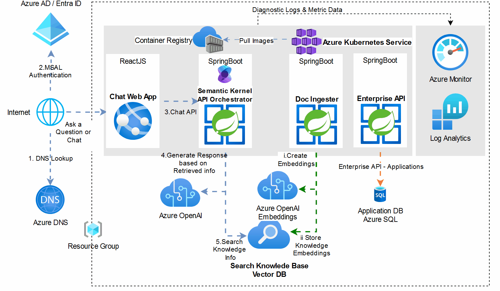

# GitHub CoPilot Devpost : Azure Fusion App

## Architecture

Azure Fusion Architecture Diagram  

## Demo

Azure Fusion Demo  

## Module : Prompt Library

### Create top level Package Structure under src/main/java

```text
PKG101 Create/Update folder 
org
   genai
    fusion
cd src/main/java
mkdir -p org/genai/fusion
```

```text

PKG102 Create/Update sub folders  
- api
- config
- endpoints
- exception
- llm
- model
- repository
- service
- tool
mkdir -p org/genai/fusion/api 
mkdir -p org/genai/fusion/config 
mkdir -p org/genai/fusion/endpoints 
mkdir -p org/genai/fusion/exception 
mkdir -p org/genai/fusion/llm 
mkdir -p org/genai/fusion/model 
mkdir -p org/genai/fusion/repository 
mkdir -p org/genai/fusion/service 
mkdir -p org/genai/fusion/tool

```

### Base Prompt

```text
Create "JavaDoc"  with Explation with Jira Id, which is the first code, as the code part of Javadoc @See Tag
```

### Create Prompt Library Model

```text
MODEL101 Create a Prompt Entity class with the following fields: id, promptNumber as String, and prompt as String. Use Lombok annotations for getters, setters, no-args constructor, and all-args constructor. Use JPA annotations for entity mapping and ID generation. Use jakarta.persistence .*  prompt is a String field supports maximum length of 1000 characters
Create "JavaDoc"  with Explation with Jira Id, which is the first code, as the code part of Javadoc @See Tag
```

### Create Prompt Library Repository

```text
REPO101 Create a PromptRepository interface that extends JpaRepository and JpaSpecificationExecutor for the Prompt entity.
Create "JavaDoc"  with Explation with Jira Id, which is the first code, as the code part of Javadoc @See Tag
```

### Create Prompt Library Service or Endpoint

```text
SVC101 Create a PromptService class that extends CrudRepositoryService for the Prompt entity.

- Annotate the class with @BrowserCallable and @AnonymousAllowed.
- Implement methods for finding all prompts, finding a prompt by ID, saving a prompt, and deleting a prompt.
Create "JavaDoc"  with Explation with Jira Id, which is the first code, as the code part of Javadoc @See Tag
```

### Create Prompt Library Exceptions

```text
EXP101 Create a new Java class named 'PromptNotFoundException' 

- This class should extend 'RuntimeException' and include a constructor that accepts a 'String' message and passes it to the superclass constructor.
Create "JavaDoc"  with Explation with Jira Id, which is the first code, as the code part of Javadoc @See Tag
```

```text
EXP102 Create a new Java class named 'PromptErrorResponse' 

- This class should use Lombok annotations `@Getter' and `@Setter' to generate getter and setter methods.
- It should also have three private fields: 'int status', 'String message', and 'long timeStamp'.
Create "JavaDoc"  with Explation with Jira Id, which is the first code, as the code part of Javadoc @See Tag
```

```text
EXP103 Create a new Java class named 'PromptExceptionHandler' 
- Annotate the class with `@ControllerAdvice'. Inside the class, create two methods annotated with `@ExceptionHandler':

1. 'handleException(PromptNotFoundException exc):
- Create a 'PromptErrorResponse' object.
- Set the status to 'HttpStatus.NOT_FOUND.value()'.
- Set the message to 'exc.getMessage()'.
- Set the timestamp to 'System.currentTimeMillis('.
- Return a 'ResponseEntity<PromptErrorResponse>` with the error object and 'HttpStatus.NOT_FOUND'.

2. 'handleException(Exception exc):
- Create a 'PromptErrorResponse' object.
- Set the status to 'HttpStatus.BAD_REQUEST.value('.
- Set the message to `exc.getMessage()'.
- Set the timestamp to 'System.currentTimeMillis('.
- Return a 'ResponseEntity<PromptErrorResponse>' with the error object and 'HttpStatus.BAD_REQUEST'.
Create "JavaDoc"  with Explation with Jira Id, which is the first code, as the code part of Javadoc @See Tag
```

### Create Prompt Library API

```text
API101 Create a Spring Boot REST controller class named 'PromptRestController' with the following specifications:
- The class should be annotated with `@RestController',@CrossOrigin(origins = "*") and `@RequestMapping("/api")'.
- The class should have a constructor that takes a 'PromptService' object as a parameter and initializes a private final field
`promptService'.
- The class should have the following endpoints:
- `GET /prompts': Returns a list of all prompts. `@GetMapping'.
- GET /prompts/(promptld} : Returns a prompt by ID. Annotate with `@GetMapping'. Throws 'PromptNotFoundException' if
the prompt is not found.
- 'POST /prompts': Adds a new prompt. Annotate with `@PostMapping'. Sets the prompt ID to 0 before saving.
- `PUT /prompts/{promptld}' : Updates an existing prompt. Annotate with ' `@PutMapping'. Sets the prompt ID to the path
variable before saving.
- 'DELETE /prompts/{promptld} : Deletes a prompt by ID. Throws 'PromptNotFoundException' if the prompt is not found.
Create "JavaDoc"  with Explation with Jira Id, which is the first code, as the code part of Javadoc @See Tag
```

### Create Prompt Data Load SQL

```text
INSERT INTO Prompt (promptNumber, prompt) VALUES ('MODEL101', 'Create a Prompt entity class with the following fields: id, promptNumber, and prompt. Use Lombok annotations for getters, setters, no-args constructor, and all-args constructor. Use JPA annotations for entity mapping and ID generation.'); 
INSERT INTO Prompt (promptNumber, prompt) VALUES ('REPO101', Create a PromptRepository interface that extends JpaRepository and JpaSpecificationExecutor for the Prompt entity."); 
INSERT INTO Prompt (promptNumber, prompt) VALUES ('SVC101', 'Create a PromptService class that extends CrudRepositoryService for the Prompt entity. Annotate the class with @BrowserCallable and @AnonymousAllowed. Implement methods for finding all prompts, finding a prompt by ID, saving a prompt, and deleting a prompt.); 
INSERT INTO Prompt (promptNumber, prompt) VALUES ('EXP101', 'Create a new Java class named PromptNotFoundException. This class should extend RuntimeException and include a constructor that accepts a String message and passes it to the superclass constructor."); 
INSERT INTO Prompt (promptNumber, prompt) VALUES ('EXP102', 'Create a new Java class named PromptErrorResponse. This class should use Lombok annotations @Getter and @Setter to generate getter and setter methods. It should also have three private fields: int status, String message, and long timeStamp."); 
INSERT INTO Prompt (promptNumber, prompt) VALUES ('EXP103', 'Create a new Java class named PromptExceptionHandler. Annotate the class with @ControllerAdvice. Inside the class, create two methods annotated with @ExceptionHandler: handleException(PromptNotFoundException exc), handleException(Exception exc).'); 
INSERT INTO Prompt (promptNumber, prompt) VALUES ('API101', 'Create a Spring Boot REST controller class named PromptRestController with the following specifications: The class should be annotated with @RestController,@CrossOrigin(origins = "*") and @RequestMapping("/api"). The class should have a constructor that takes a PromptService object as a parameter and initializes a private final field promptService. The class should have the following endpoints: GET /prompts, GET /prompts/(promptld), POST /prompts, PUT /prompts/{promptld}, DELETE /prompts/{promptld}.);
```

### Create Prompt Library UI

```text
REACT101 Create a React component named 'Prompts' that uses the 'useState' hook to manage two state variables: 'name' and `message'. The component should render a 'div' with a class of `p-m flex flex-col h-full box-border'. Inside the `div', render an 'h2' element with the text "Welcome to Prompts Library". Below the 'h2', render an 'AutoCrud' component from the "@vaadin/hilla-react-crud' package. The 'AutoCrud' component should use 'PromptModel' for the 'model' prop and 'PromptService' for the 'service' prop. It should also have a `className' of 'flex-grow' and a formProps' prop with `fieldOptions' that specifies a custom renderer for the 'prompt' field using a 'TextArea' component from the '@vaadin/react- components' package. Additionally, define a 'config' object with a 'menu' property that has a 'title' of 'Prompts' and an 'order' of 2. Import all necessary dependencies at the top of the file.
```

## Module : Loan Application

### Create Loan Application Model

```text
MODEL101 Create a Prompt Entity class with the following fields: id, promptNumber as String, and prompt as String. Use Lombok annotations for getters, setters, no-args constructor, and all-args constructor. Use JPA annotations for entity mapping and ID generation. Use jakarta.persistence .*  prompt is a String field supports maximum length of 1000 characters
Create "JavaDoc"  with Explation with Jira Id, which is the first code, as the code part of Javadoc @See Tag
```

### Create Prompt Library Repository

```
MODEL101 Create a Prompt Entity class with the following fields: id, promptNumber as String, and prompt as String. Use Lombok annotations for getters, setters, no-args constructor, and all-args constructor. Use JPA annotations for entity mapping and ID generation. Use jakarta.persistence .*  prompt is a String field supports maximum length of 1000 characters
Create "JavaDoc"  with Explation with Jira Id, which is the first code, as the code part of Javadoc @See Tag
```

### Create Prompt Library Service or Endpoint

```
SVC101 Create a PromptService class that extends CrudRepositoryService for the Prompt entity.Annotate the class with @BrowserCallable and @AnonymousAllowed.Implement methods for finding all prompts, finding a prompt by ID, saving a prompt, and deleting a prompt.
Create "JavaDoc"  with Explation with Jira Id, which is the first code, as the code part of Javadoc @See Tag
```

## Module : Semantic Kernel

### Search Knowledge Base

```
PLUGIN101 Create a function named `searchInAnIndex` in the `SKPlugins` class. This function should:
- Be annotated with `@KernelFunctionParameter` with a description "the query to answer" and name "query".
- Log the query using `log.debug`.
- Return a `Mono<List<String>>` by calling `contentRetriever.searchKnowledgeBase(query)`.
Create "JavaDoc" with Explanation with Jira Id, which is the first code, as the code part of Javadoc @See Tag
```

### Search Knowledge Base

```
PLUGIN101 Create a function named `searchInAnIndex` in the `SKPlugins` class. This function should:
- Be annotated with `@KernelFunctionParameter` with a description "the query to answer" and name "query".
- Log the query using `log.debug`.
- Return a `Mono<List<String>>` by calling `contentRetriever.searchKnowledgeBase(query)`.
Create "JavaDoc" with Explanation with Jira Id, which is the first code, as the code part of Javadoc @See Tag
```

### Get Loan By Application Number

```
PLUGIN102 Create a function named `getLoanApplicationByLoanNumber` in the `SKPlugins` class. This function should:
- Be annotated with `@DefineKernelFunction` with name "GetLoanApplicationDetailsByLoanNumber", description "Retrieves Loan Application details for the provided loan number", and returnType "org.genai.fusion.model.LoanApplication".
- Log the loan number using `log.debug`.
- Return a `LoanApplication` by calling `loanApplicationEndpoint.findByLoanNumber(loanNumber).orElse(null)`.
Create "JavaDoc" with Explanation with Jira Id, which is the first code, as the code part of Javadoc @See Tag
```

### Get Loan By Email

```

PLUGIN103 Create a function named `getLoanApplicationByEmail` in the `SKPlugins` class. This function should:
- Be annotated with `@DefineKernelFunction` with name "GetLoanApplicationDetailsByEmail", description "Retrieves Loan Application details for the provided email address", and returnType "org.genai.fusion.model.LoanApplication".
- Log the email address using `log.debug`.
- Return a `LoanApplication` by calling `loanApplicationEndpoint.findByEmail(email).orElse(null)`.
Create "JavaDoc" with Explanation with Jira Id, which is the first code, as the code part of Javadoc @See Tag
```

### Update Loan Application

```
PLUGIN104 Create a function named `updateLoanApplicationAddressByLoanNumber` in the `SKPlugins` class. This function should:
- Be annotated with `@DefineKernelFunction` with name "UpdateLoanApplicationAddressByLoanNumber", description "Update the address for a given application loan number", and returnType "org.genai.fusion.model.LoanApplication".
- Log the loan number using `log.debug`.
- Retrieve the `LoanApplication` by calling `loanApplicationEndpoint.findByLoanNumber(loanNumber).orElse(null)`.
- If the `LoanApplication` is found, update the address, set KYC verification to true, set loan status to "APPROVED", save the `LoanApplication`, log the success, and return the updated `LoanApplication`.
- If the `LoanApplication` is not found, log the failure and return null.
Create "JavaDoc" with Explanation with Jira Id, which is the first code, as the code part of Javadoc @See Tag
```

### Create Loan Application

```
PLUGIN104 Create a function named `updateLoanApplicationAddressByLoanNumber` in the `SKPlugins` class. This function should:
- Be annotated with `@DefineKernelFunction` with name "UpdateLoanApplicationAddressByLoanNumber", description "Update the address for a given application loan number", and returnType "org.genai.fusion.model.LoanApplication".
- Log the loan number using `log.debug`.
- Retrieve the `LoanApplication` by calling `loanApplicationEndpoint.findByLoanNumber(loanNumber).orElse(null)`.
- If the `LoanApplication` is found, update the address, set KYC verification to true, set loan status to "APPROVED", save the `LoanApplication`, log the success, and return the updated `LoanApplication`.
- If the `LoanApplication` is not found, log the failure and return null.
Create "JavaDoc" with Explanation with Jira Id, which is the first code, as the code part of Javadoc @See Tag
```
